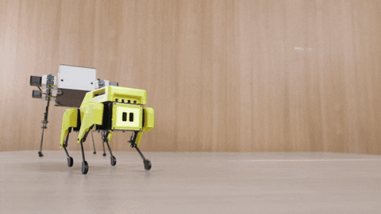

# Welcome to my Github!

Im a Roboticist specialising in all things Robotics, ML, and Mechatronics. Check out my repos 🙂   
My relevant fields and projects include:

- Machine Learning for Robots: [Robotic Finger](https://github.com/Alexis-Georganopoulos/Robotic-Finger)
- Computer Vision/Convolutional Networks: [CIFAR-10 Classifier](https://github.com/Alexis-Georganopoulos/Image_Classifier)
- Natural Language Processing(NLP): [Sentiment Classifier](https://github.com/Alexis-Georganopoulos/Sentiment_Classifier)
- Forward/Backward Kinematics on Robots: [Bipedal Robot](https://github.com/Alexis-Georganopoulos/Bipedal_Robot_Locomotion)
- Control Systems for Robots: [Line Follower](https://github.com/Alexis-Georganopoulos/Arduino_Line_Follower), [Bipedal Robot](https://github.com/Alexis-Georganopoulos/Bipedal_Robot_Locomotion)
- Map planning/ Localisation algorithms(SLAM): [Space-Filling Robots](https://github.com/Alexis-Georganopoulos/Space_Filling_Robots)
- Software Development with tight Robot Hardware Requirements: [Thymio-Python Compiler](https://github.com/Alexis-Georganopoulos/Python-Compiler)
- Optical Sensor Simulation for Telescopic Systems: [ESSPRESO Spectrograph](https://github.com/Alexis-Georganopoulos/Masters-Thesis) 
- And pure coding fun!: [Particle Simulator](https://github.com/Alexis-Georganopoulos/Particle_Simulator)

Lets make cheap robots a reality! 🤖🤖🤖

<!---
- 👋 Hi, I’m @Alexis-Georganopoulos
- 👀 I’m interested in ...
- 🌱 I’m currently learning ...
- 💞️ I’m looking to collaborate on ...
- 📫 How to reach me ...
  im testing some stufff
--->

<!---
Alexis-Georganopoulos/Alexis-Georganopoulos is a ✨ special ✨ repository because its `README.md` (this file) appears on your GitHub profile.
You can click the Preview link to take a look at your changes.
--->
